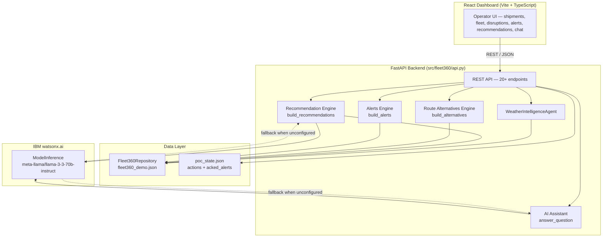

# Fleet360 Architecture

## Current State

Fleet360 is a fully implemented POC backend and dashboard. All components
described below are running code, not placeholders.

## Components

| Component | Technology | Responsibility |
|---|---|---|
| React Dashboard | TypeScript, React 18, Vite | Single-page operations dashboard — live map, shipment/vehicle/disruption lists, recommendations panel, alert feed, route alternatives, AI assistant chat |
| FastAPI Backend | Python 3.11+, FastAPI, Pydantic v2 | 20+ REST endpoints; OpenAPI docs auto-served at `/docs` |
| Weather Intelligence Agent | Deterministic Python (`weather_agent.py`) | Match disruptions to shipments by location and route corridor; score impact by severity, cargo sensitivity, priority, and deadline pressure |
| Recommendation Engine | Deterministic Python (`poc.py`) | Build prioritised reroute / redeploy / inspect recommendations from weather impacts and cold-chain excursions; narrated by watsonx.ai |
| Route Alternatives Engine | Deterministic Python + Haversine (`poc.py`) | Generate two detour options per shipment with extra km / time / fuel / cost in ₹ |
| Alerts Engine | Deterministic Python (`poc.py`) | Surface ranked CRITICAL→LOW alerts from disruptions, weather impacts, and temperature excursions; persist acknowledgements |
| AI Assistant | IBM watsonx.ai + rule-based fallback (`poc.py`, `watsonx.py`) | Answer free-text operator questions grounded in live fleet context |
| Domain Layer | Python dataclasses (`domain.py`) | Validated, immutable domain objects for Shipment, Vehicle, Disruption, TemperatureLog, RiskAssessment, RecoveryRecommendation, StandardizedAgentEvent |
| Repository | `Fleet360Repository` (`repository.py`) | File-backed read-only data access over `fleet360_demo.json`; isolates agents and APIs from raw JSON parsing |
| State Persistence | JSON file (`poc_state.json`) | Append-only store for operator actions and alert acknowledgements |
| Configuration | `AppSettings` + `src/.env.example` | Environment-variable-backed settings with validation |
| Synthetic Data | `src/data/fleet360_demo.json` | 20+ shipments, 15+ vehicles, 4 disruptions, temperature sensor logs across Indian logistics corridors |

## Domain Contract — `StandardizedAgentEvent`

Every agent emits this versioned struct so a future correlator can process all
agent types through one input contract without coupling to agent internals.

| Field | Purpose |
|---|---|
| `schema_version` | Explicit contract version — consumers can reject unknown versions |
| `agent_type` | `weather` / `geopolitical` / `cold_chain` |
| `event_type` | `weather` / `geopolitical` / `temperature_excursion` |
| `severity` | `low` / `medium` / `high` / `critical` |
| `occurred_at`, `received_at` | Event origin and processing timestamps |
| `confidence` | Agent-reported confidence score (0–1) |
| `location_ids`, `route_ids`, `shipment_ids`, `vehicle_ids` | Affected entity references |
| `payload` | Agent-specific evidence bag; not read by the contract layer |

## Weather Agent Data Flow

1. `WeatherIntelligenceAgent.assess_disruption(disruption_id)` fetches the
   disruption and all active shipments from `Fleet360Repository`.
2. `_matches()` checks location aliases (stripping suffixes like " port",
   " airport", " region") and ordered route corridors using `_route_in_corridor`.
3. `_assess_shipment()` scores each match on four axes — disruption severity,
   cargo sensitivity (`pharmaceuticals` / `food` → HIGH), shipment priority,
   and deadline proximity — and accumulates an integer score mapped to
   LOW / MEDIUM / HIGH / CRITICAL.
4. A `StandardizedAgentEvent` is built with all affected shipment and vehicle IDs
   and the structured assessment evidence as payload.
5. The `WeatherAssessment` result (disruption metadata + impact list + event) is
   returned to the API and forwarded to `build_recommendations`.

## API Endpoints

| Method | Path | Description |
|---|---|---|
| GET | `/api/health` | Service liveness check |
| GET | `/api/shipments` | All shipments |
| GET | `/api/shipments/{id}` | Single shipment |
| GET | `/api/fleet` | All vehicles |
| GET | `/api/fleet/idle` | Idle vehicles only |
| GET | `/api/fleet/{id}` | Single vehicle |
| GET | `/api/disruptions` | All disruptions |
| GET | `/api/disruptions/{id}` | Single disruption |
| GET | `/api/temperature/{shipment_id}` | Temperature logs for a shipment |
| GET | `/api/weather/assessments` | All weather impact assessments |
| GET | `/api/weather/assessments/{disruption_id}` | Assessment for one disruption |
| GET | `/api/weather/impacts/{disruption_id}` | Shipment impacts for one disruption |
| GET | `/api/weather/shipments/{shipment_id}` | All weather impacts on one shipment |
| GET | `/api/weather/events/{disruption_id}` | `StandardizedAgentEvent` for one disruption |
| GET | `/api/recommendations` | Prioritised operator recommendations |
| GET | `/api/actions` | Logged operator actions |
| POST | `/api/actions` | Log a new operator action |
| GET | `/api/alerts` | Ranked alert feed |
| POST | `/api/alerts/ack` | Acknowledge an alert |
| GET | `/api/routes/alternatives/{shipment_id}` | Two route detour options |
| POST | `/api/assistant/ask` | Ask the AI assistant a free-text question |

## watsonx.ai Integration

`src/fleet360/watsonx.py` wraps the `ibm-watsonx-ai` SDK behind a single
function `granite_generate(prompt, max_tokens)`.

- The `ModelInference` client is lazily initialised once per process and
  cached; subsequent calls reuse it.
- If `WATSONX_API_KEY` or `WATSONX_PROJECT_ID` is missing, the function
  returns `None` immediately — no exception propagates to the caller.
- The `chat()` API is used with a single user message so any instruct model
  can be substituted without prompt-template changes.
- Both callers (`answer_question` and `_narrate_recommendation`) check for
  `None` and fall back silently to rule-based output.

## Security and Scalability Notes

- No credentials are committed. `src/.env` is in `.gitignore`. The backend
  loads `.env` via `python-dotenv` if present, otherwise reads from the shell
  environment directly.
- Domain objects are frozen dataclasses — immutable after construction.
- The event contract is versioned (`schema_version="1.0"`) so future breaking
  changes can be detected by consumers before processing.
- CORS is restricted to `localhost:3000` and `localhost:5173` (Vite dev server
  defaults). Production deployment would tighten this to the actual origin.
- `poc_state.json` is append-only in the current POC; a real deployment would
  replace it with a proper database and row-level locking.
