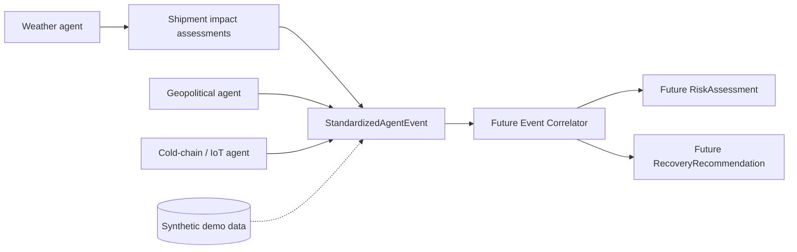

# Fleet360 Architecture

## Current Foundation

Fleet360 is being built as a decision engine first. The current repository
contains validated domain objects and a common event contract; it does not yet
contain running agents, an API, persistence, optimization, UI, MCP, or LLM
integration.

## Components

| Component | Current technology | Responsibility |
|---|---|---|
| Domain layer | Python 3.13 standard library dataclasses | Validate and serialize shipments, vehicles, events, telemetry, risks, and recommendations |
| Agent event contract | `StandardizedAgentEvent` | Give all three future agents the same correlator input shape |
| Weather agent | Deterministic Python service | Match disruption locations and route corridors to active shipments and explain estimated impact |
| Configuration | `AppSettings` and `src/.env.example` | Read non-secret local application settings from environment variables |
| Synthetic data | JSON | Provide small, deterministic fixtures for development and later demos |
| Tests | Python `unittest` | Protect model invariants and event serialization |

## Domain Contract

`StandardizedAgentEvent` includes a version, source agent, disruption type,
severity, occurrence and receipt timestamps, source reference, confidence,
affected locations/routes/shipments/vehicles, and an extensible payload. The
payload is intentionally the only agent-specific portion; the correlator can
therefore process all three sources through one input contract.

## Current Weather Data Flow

1. The weather agent reads synthetic disruptions and active shipments through
     `Fleet360Repository`.
2. It matches location aliases and ordered route corridors, including routes
     with intermediate waypoints.
3. It combines disruption severity, cargo sensitivity, priority, and deadline
     pressure into an explainable impact assessment.
4. It emits a versioned `StandardizedAgentEvent` containing affected shipment
     identifiers and structured assessment context.

## Planned Data Flow

1. Each future source adapter will observe raw weather, geopolitical, or temperature data.
2. The adapter will emit a validated `StandardizedAgentEvent`.
3. The future correlator will match event identifiers against active shipments
     and vehicles, then produce explainable `RiskAssessment` objects.
4. A future optimization layer will produce `RecoveryRecommendation` objects
     using deterministic route and fleet algorithms.
5. An eventual AI interface may explain those structured results, but will not
     own risk calculation or numerical optimization.

## Security and Scalability Decisions

- Only `.env.example` is committed. Real credentials are not needed by the
    current foundation and must not be added to the repository.
- Domain objects are immutable after construction, which reduces accidental
    mutation as events move between future adapters and the correlator.
- The event contract is versioned so future schema changes can be introduced
    deliberately rather than silently breaking consumers.
