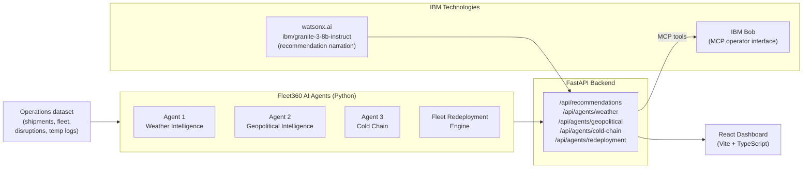

# Solution Overview

## What We Built

Fleet360 is an AI-powered supply chain operations assistant that moves beyond
traditional fleet tracking. Instead of just showing operators where their
vehicles are, Fleet360 answers: *"Something just happened — which shipments
are at risk, what resources can fix it, and what should we do first?"*

The platform combines three specialised AI agents, a fleet redeployment engine,
and an IBM Bob integration that lets operators query the entire system in
natural language.

---

## How It Works

1. **Disruption signals arrive** — weather events, geopolitical alerts (port
   strikes, export restrictions, border delays), and IoT temperature sensor
   readings are ingested as structured events.

2. **Agent 1 — Weather Intelligence** matches each active disruption to
   affected shipments via route corridor analysis, then scores impact using
   disruption severity, cargo sensitivity, and deadline pressure. It produces
   a `RecoveryRecommendation` (reroute or redeploy) for every affected
   shipment.

3. **Agent 2 — Geopolitical Intelligence** maps each active geopolitical event
   to affected commodities, finds shipments carrying those commodities, and
   recommends alternative carriers or routes pre-cleared for the corridor.

4. **Agent 3 — Cold Chain Intelligence** scans temperature logs for
   excursions, calculates how long the breach has lasted, classifies severity
   (stricter thresholds for pharmaceuticals than food), identifies the nearest
   depot for intervention, and generates an action instruction.

5. **Fleet Redeployment Engine** scores all idle vehicles against every
   at-risk shipment using proximity (70%), capacity headroom (20%), and fuel
   level (10%), returning ranked match lists so operators can act immediately.

6. **IBM watsonx.ai (ibm/granite-3-8b-instruct)** converts the structured
   recommendations into plain-language operator briefings via
   `GET /api/recommendations?narrate=true`.

7. **IBM Bob MCP Server** exposes all agent endpoints as 11 registered tools.
   Operators ask Bob questions in natural language; Bob calls the relevant
   Fleet360 tools and returns structured intelligence.

8. **React Dashboard** surfaces all agent outputs — disruption cards, shipment
   impact drawers, cold-chain panels, idle fleet, and the Recovery Workbench —
   in a single real-time view backed by the FastAPI backend.

---

## Architecture Diagram



---

## Key Design Decisions

| Decision | Rationale |
|---|---|
| Three separate agents with a shared `RecoveryRecommendation` model | Each agent has different signal types and logic, but all output the same structure — the dashboard and MCP server consume one unified `/api/recommendations` endpoint |
| IBM Bob as the operator interface via MCP | Operators can ask questions in natural language without learning a new UI. Bob calls the real agent endpoints — not a mock — so it's load-bearing |
| watsonx.ai for narration, not for agent logic | The risk scoring, route matching, and redeployment decisions are deterministic Python — reproducible, testable, auditable. Granite adds human-readable explanation on top, not underneath |
| Graceful degradation without IBM credentials | Both IBM integrations fall back cleanly: the MCP server works without watsonx.ai; narration returns deterministic text when `WATSONX_API_KEY` is not set |
| Deterministic offline-ready data, no external APIs | Keeps the demo fully reproducible on any machine with no API keys or network access required for the core functionality |

---

## IBM Technologies Used

### 1. IBM Bob — MCP Integration (load-bearing)

**File:** [`src/mcp-server/src/index.ts`](../src/mcp-server/src/index.ts)

IBM Bob is the operator-facing intelligence interface for Fleet360. A custom
MCP server written in TypeScript exposes **11 tools** that connect Bob
directly to the Fleet360 agent backend:

| Tool | What it does |
|---|---|
| `fleet360_situation_summary` | Full operational briefing — shipments, disruptions, alerts, top 3 actions |
| `fleet360_weather_impact` | Weather agent assessment for a specific disruption |
| `fleet360_all_weather_assessments` | All weather impacts across all active disruptions |
| `fleet360_geopolitical_assessments` | All geopolitical event impacts with carrier/route alternatives |
| `fleet360_cold_chain_alerts` | All active temperature excursion alerts |
| `fleet360_cold_chain_shipment` | Cold-chain status for a specific shipment |
| `fleet360_recommendations` | All prioritized recovery recommendations |
| `fleet360_find_idle_vehicle` | Best idle vehicle matches for a disrupted shipment |
| `fleet360_shipment_status` | Full shipment detail including all active impacts |
| `fleet360_idle_fleet` | All idle vehicles available for redeployment |

**Example operator conversation with IBM Bob:**

> *"What's the situation right now?"*
> → Bob calls `fleet360_situation_summary` → returns 4 active disruptions,
> 15 shipments at risk, 2 cold-chain alerts, 3 idle vehicles, 35 recommendations.

> *"Which shipments are affected by the Mumbai flooding?"*
> → Bob calls `fleet360_weather_impact("DIS-001")` → returns 5 affected
> shipments with impact levels, delays, and recommended actions.

> *"Find me an idle refrigerated vehicle for SHP-1001"*
> → Bob calls `fleet360_find_idle_vehicle("SHP-1001")` → returns VH-012
> (Refrigerated truck, Pune, 64 km away, fit score 82%).

**Registration:** `mcp.json` at the repo root registers the server. Start
the backend, then open IBM Bob — the Fleet360 tools appear automatically.

---

### 2. IBM watsonx.ai — `ibm/granite-3-8b-instruct` (recommendation narration)

**File:** [`src/backend/narration.py`](../src/backend/narration.py)

The Fleet360 agents produce structured `RecoveryRecommendation` objects with
typed fields (route, vehicle, carrier, saving). `narration.py` calls the
watsonx.ai text generation REST API with `ibm/granite-3-8b-instruct` to
convert each recommendation into a single plain-language operator briefing.

**How it is called:**

```
GET /api/recommendations?narrate=true
```

Each recommendation in the response gains two fields:

```json
{
  "operator_briefing": "Reroute SHP-1001 via Mumbai-Nashik-Pune immediately — ...",
  "narration_source":  "watsonx.ai ibm/granite-3-8b-instruct"
}
```

**The prompt is structured, not open-ended.** The model receives the typed
recommendation fields (shipment ID, action type, route, vehicle, saving
hours) and is asked to write one operator-facing sentence. This ensures
the output is grounded in the agent's structured decision, not invented by
the model.

**Graceful fallback:** When `WATSONX_API_KEY` and `WATSONX_PROJECT_ID` are
not set, `narrate_recommendation()` returns a deterministic text built from
the same structured fields — the application works identically without
credentials. Set the variables in `src/backend/.env` to enable live
Granite narration.
